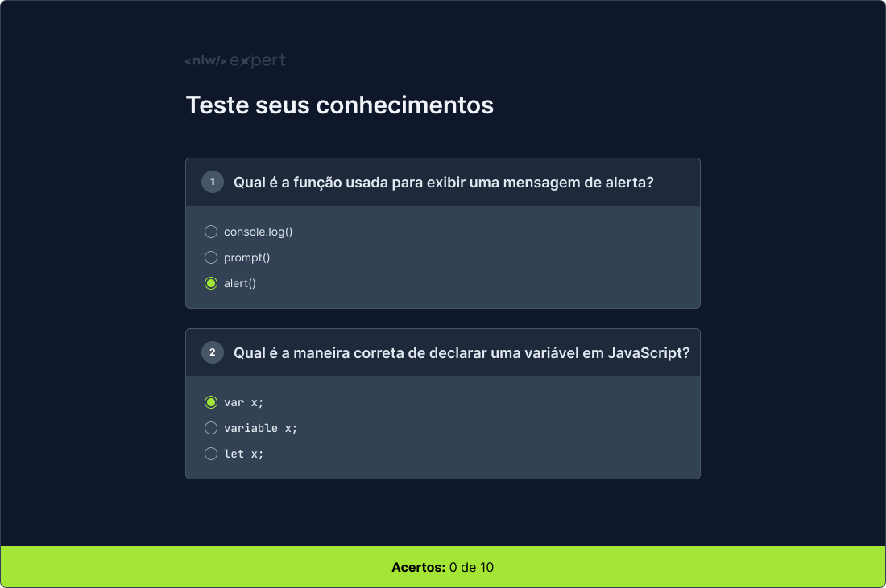

  
  <h1>Quiz • NLW Expert</h1>
  Aplicativo de <strong>quiz</strong> pra testar os seus conhecimentos técnicos e ter um retorno sobre a quantidade de questões que você acertou

 
 

  

## Site 💻
- [Quiz • NLW Expert](https://quizdevjs.vercel.app)

## Tecnologias: 🚀
- HTML
- CSS
- Javascript

